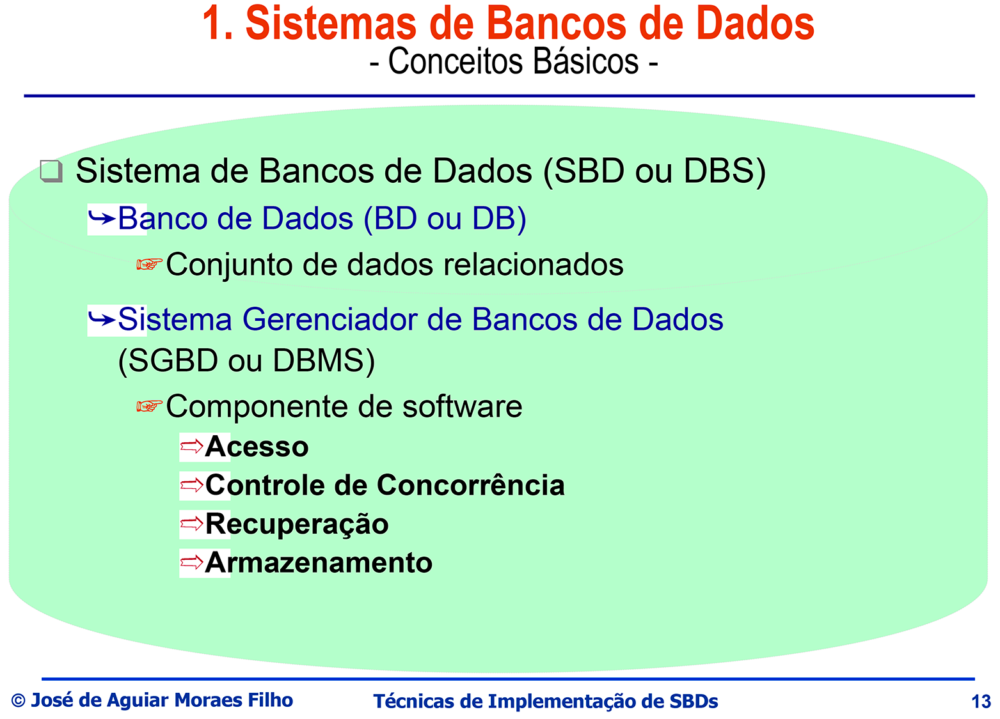

## Sistema de Bando de Dados 2
### Prof. Aguiar

## Notas de Aulas

### Sistema de Bancos de Dados - Indexação

1. Índice
2. Arquivos de Índices
2.1 Árvores B
2.2 Árvores $B^+$
2.3 Hashing
3. Indexação Espacial
3.1 Grid-Files
3.2 Quad-Trees
3.3 Kd-Trees

