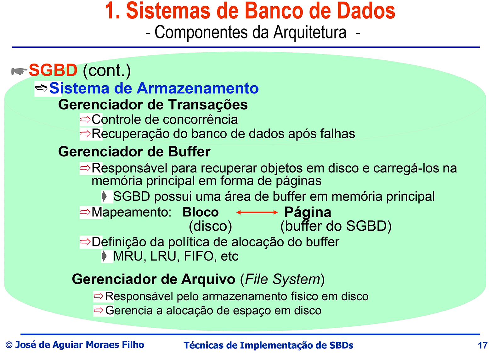
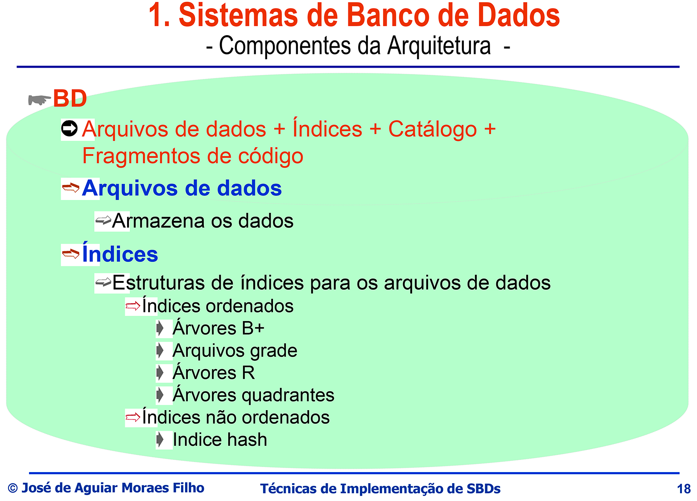
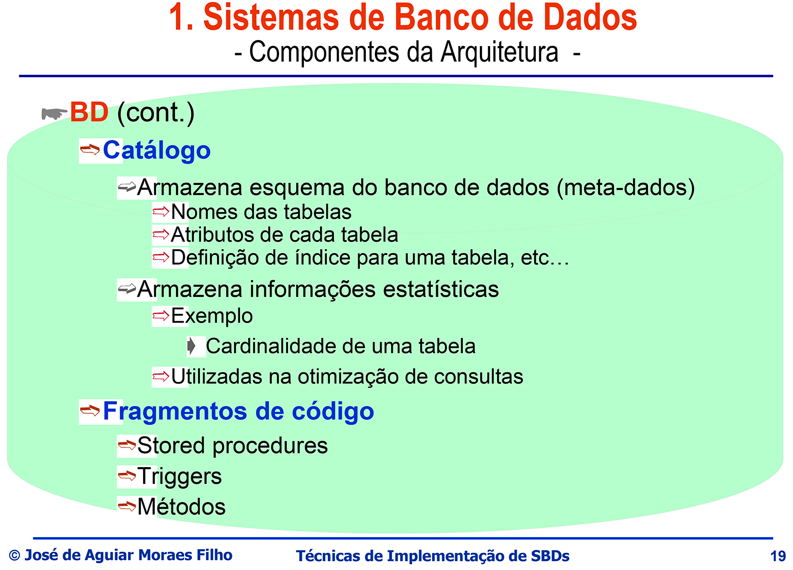
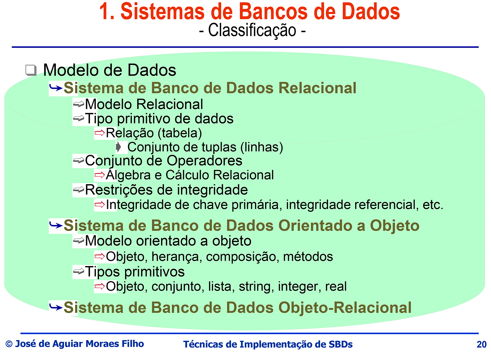

## Sistema de Bando de Dados 2
### Prof. Aguiar

## Notas de Aulas

### Sistema de Bancos de Dados

Um SGDB é uma coleção de arquivos e programas inter-relacionados que permitem ao usuário o acesso para consultas e alterações desse dados. O maior benefício de um banco de dados é proporcionar ao usuário uma visão abstrata desses dados.

Quando o banco de dados é projetado para atender às necessidades de informações de uma organização, planos (ou esquemas) do banco de dados e os dados reais a serem armazenados nele se tornam a preocupação mais importante da organização.

É importante observar que os dados no banco de dados são alterados com frequência, enquanto os planos permanecem os mesmos por longos períodos de tempo (embora não necessariamente para sempre). Os planos de banco de dados consistem em tipos de entidades com as quais um banco de dados lida, os relacionamentos entre essas entidades e as maneiras pelas quais as entidades e os relacionamentos são expressos de um nível de abstração para o próximo nível para a visualização dos usuários.

A visão dos usuários pelos dados (também denominada organização lógica dos dados) deve ser da forma mais conveniente para os usuários e eles não devem se preocupar com a maneira como os dados são organizados fisicamente. Portanto, um SGBD deve fazer a conversão entre o código lógico

1. Esquema

O plano (ou formulação do esquema) do banco de dados é conhecido como esquema. Esquema fornece os nomes das entidades e atributos. Especifica o relacionamento entre eles.

É uma estrutura na qual os valores dos itens de dados (ou campos) são ajustados. Os planos ou o formato do esquema permanecem os mesmos. Mas os valores ajustados nesse formato mudam de instância para instância. Em outros termos, esquema significa um plano geral de todos os tipos de item de dados (campo) e tipos de registro armazenados em um banco de dados. O esquema inclui a definição do nome do banco de dados, o tipo de registro e os componentes que compõem esses registros.

Um esquema de banco de dados corresponde às declarações de variáveis ​​(junto com as definições de tipo associadas) em um programa. O diagrama do esquema exibe a estrutura de cada tipo de registro, mas não as instâncias reais dos registros. Cada objeto no esquema, por exemplo, PRODUCT, CUSTOMER ou SALES, é chamado de construção de esquema.

### Arquitertura de Três Camadas

O objetivo dessa arquitetura e separar as aplicações do usuário do banco de dados fisicos. Nessa arquitetura os esquemas são divididos em três níveis.

1. O Nível interno

    Descreve a estrutura do armazenamento físico do banco de dados, usa um modelo de dados físico e descreve os detalhes completos do armazenamento de dados e os caminhos de acesso.

2. O Nível conceitual

    Descreve a estrutura do banco de dados inteiro para o usuário, ele oculta os detalhes das estruturas de armazenamento físico e concentra-se na descrição das entidades.

3. O Nível externo

   Inclui uma serie de visões externos ou visões do usuário. Cada esquema externo descreve a parte do banco de dados em que um grupo de usuário em particular está interessado.

> A visualização em cada um dos níveis acima é descrita por um esquema, que é um esboço ou plano que descreve os registros, atributos e relacionamentos existentes na exibição.
>
> O termo visão, esquema são usados de forma intercambiável.
>
> Uma linguagem de definição de dados (DDL), é usada para definir os esquemas conceituais e externos.
>
> Os comandos da linguagem de consulta estruturada (SQL) são usados para descrever os aspectos do esquema físico (ou interno).
>
> As informações sobre os esquemas interno, conceitual e externo são armazenadas no catálogo do sistema.

#### Nível interno ou Nível físico

Nível interno é a representação física do banco de dados no computador e essa visualização é encontrada no nível mais baixo de abstração do banco de dados.

Este nível indica como os dados serão armazenados no banco de dados e descreve as estruturas de dados, as estruturas de arquivos e os métodos de acesso a serem usados ​​pelo banco de dados.

Ele descreve a maneira como o SGDB e o sistema operacional recebem os dados no banco de dados. Logo abaixo do nível interno, há uma organização de dados no nível físico cuja implementação é coberta pelo nível interno para obter desempenho rotineiro e utilização do espaço de armazenamento.

O esquema interno define o nível interno (ou visualização). O esquema interno contém a definição do registro armazenado, o método de representação dos campos de dados (ou atributos), esquemas de indexação e hash e os métodos de acesso utilizados.

O nível interno fornece cobertura para as estruturas de dados e organizações de arquivos usadas para armazenar dados em dispositivos de armazenamento.

É o mais baixo nível de abstração que descreve como esses dados estão de fato armazenado. No nível físico, estrutura de dados complexas de nível baixo são descritas em detalhes.

> Essencialmente, o esquema interno resume como as relações descritas no esquema conceitual são realmente armazenadas em dispositivos de armazenamento secundário, como discos e fitas. Ele faz interface com os métodos de acesso do sistema operacional (também chamados de técnicas de gerenciamento de arquivos para armazenar e recuperar registros de dados) para colocar os dados nos dispositivos de armazenamento, criar os índices, recuperar os dados e assim por diante. O nível interno preocupa-se com as seguintes atividades:

* Alocação de espaço de armazenamento para dados e armazenamento.
* Registro e descrições para armazenamento com tamanhos armazenados para itens de dados.
* Gravar posicionamento.
* Técnicas de compactação e criptografia de dados.

#### Nível Conceitual ou Nível lógico

O nível conceitual é o nível intermediário na arquitetura de três camadas. Nesse nível de abstração do banco de dados, todas as entidades e relacionamentos entre eles são incluídos. O nível conceitual fornece a visão da comunidade do banco de dados e descreve quais dados são armazenados no banco de dados e os relacionamentos entre os dados. Ele contém a estrutura lógica de todo o banco de dados, conforme visto pelo DBA. Uma visão conceitual representa todo o banco de dados de uma organização. É uma visão completa dos requisitos de dados da organização, independente de quaisquer considerações de armazenamento. O esquema conceitual define a visão conceitual. **Também é chamado de esquema lógico** . Existe apenas um esquema conceitual por banco de dados. O nível conceitual está relacionado às seguintes atividades:

* Todas as entidades, seus atributos e seus relacionamentos.
* Restrição nos dados.
* Informações semânticas sobre os dados.
* Verifica para manter a consistência e a integridade dos dados.
* Informação segura

O nível conceitual suporta cada visão externa, na medida em que quaisquer dados disponíveis para um usuário devem estar contidos ou derivados do nível conceitual.

No entanto, este nível não deve conter nenhum detalhe dependente de armazenamento. Por exemplo, a descrição de uma entidade deve conter apenas tipos de dados de atributos (por exemplo, número inteiro, real, caractere etc.) e seu comprimento (como o número máximo de dígitos ou caracteres), mas nenhuma consideração de armazenamento, como o número de bytes ocupados.

A escolha das relações e a escolha do campo (ou item de dados) para cada relação nem sempre é óbvia. O processo de obtenção de um bom esquema conceitual é chamado de **design conceitual de banco de dados**. O esquema conceitual é escrito usando a linguagem de definição de dados conceituais **"DDL conceitual"**.

#### Nível Externo ou Nível de visão

O nível externo é a visão do usuário do banco de dados. Esse nível está no nível mais alto de abstração de dados, onde apenas as partes do banco de dados relacionadas a um usuário ou programa de aplicativo estão incluídas.

Em outras palavras, esse nível descreve a parte do banco de dados relevante para o usuário. Cada usuário tem uma visão do "mundo real" representado de uma forma familiar para esse ele.

A visão externa inclui apenas as entidades, atributos e relacionamentos no “mundo real” em que o usuário está interessado. Outras entidades, atributos e relacionamentos que não são de interesse do usuário, podem ser representados no banco de dados, mas o usuário não tenha conhecimento deles.

No nível externo, as diferentes visualizações podem ter diferentes representações dos mesmos dados. Por exemplo, um usuário pode visualizar dados no formulário como dia, mês, ano, enquanto outro pode visualizar como ano, mês, dia. Algumas visualizações podem incluir dados derivados ou calculados, ou seja, os dados não são armazenados no banco de dados, mas são criados quando necessário. Por exemplo, a idade média de um funcionário em uma organização pode ser derivada ou calculada a partir da idade individual de todos os funcionários armazenados no banco de dados. As visualizações externas podem incluir dados combinados ou derivados de várias entidades.

Um esquema externo descreve cada visualização externa. O esquema externo consiste na definição dos registros lógicos e nos relacionamentos na visualização externa. Ele também contém o método de derivar os objetos (por exemplo, entidades, atributos e relacionamentos) na visão externa do objeto na visão conceitual. Esquemas externos permitem que o acesso a dados seja personalizado no nível de usuários individuais ou grupos de usuários.

Qualquer banco de dados fornecido possui exatamente um esquema interno ou físico e um esquema conceitual porque possui apenas um conjunto de relações armazenadas. Mas, pode ter vários esquemas externos, cada um adaptado a um grupo específico de usuários. O esquema externo é gravado usando a linguagem de definição de dados externa **"DDL externa"**.

#### Vantagens da arquitetura de três camadas

O principal objetivo da arquitetura do banco de dados de três camadas é isolar a visualização de cada usuário do banco de dados da maneira como o banco de dados é fisicamente armazenado ou representado.

As principais vantagens de uma arquitetura de banco de dados de três camadas:

* Cada usuário pode acessar os mesmos dados, mas ter uma visualização personalizada diferente dos dados conforme suas próprias necessidades. Cada usuário pode alterar a maneira como visualiza os dados e essa alteração não afeta outros usuários do mesmo banco de dados.

* O usuário não está preocupado com os detalhes físicos do armazenamento de dados. A interação do usuário com o banco de dados é independente da organização de armazenamento físico de dados.

* A estrutura interna do banco de dados não é afetada por alterações na organização do armazenamento físico, como a mudança para um novo dispositivo de armazenamento.

* O administrador do banco de dados (DBA) pode alterar as estruturas de armazenamento do banco de dados sem afetar a exibição do usuário.

* O DBA pode alterar a estrutura conceitual do banco de dados sem afetar todos os usuários.

#### Componentes da arquitetura

Uma estrutura típica de um SGBD com seus componentes e relacionamentos entre eles. O software DBMS é particionado em vários módulos.

Cada módulo ou componente recebe uma operação específica para executar. Algumas das funções do DBMS são suportadas ou fornecidas pelo sistema operacional o **SO**, para fornecer serviços básicos e o DBMS é construído sobre ele.

Os dados físicos e o catálogo do sistema são armazenados em um disco físico. O acesso ao disco é controlado principalmente pelo sistema operacional, que agenda a entrada / saída do disco. Portanto, ao projetar um DBMS, sua interface com o sistema operacional deve ser levada em consideração.

O componentes funcionais do sistema de banco de dados podem ser divididos pelos componentes de processamento de consultas e pelos componentes de administração de memória.

1. **Processador de consultas:** o processador de consultas transforma as consultas dos usuários em uma série de instruções de baixo nível direcionadas ao gerenciador do banco de dados de tempo de execução. É usado para interpretar a consulta do usuário on-line e convertê-la em uma série eficiente de operações em um formulário capaz de ser enviado ao gerenciador de dados em tempo de execução para execução. O processador de consultas usa o dicionário de dados para encontrar a estrutura da parte relevante do banco de dados e usa essas informações para modificar a consulta e **preparar um plano ideal para acessar** o banco de dados.

    > Os componentes de pocessamento de consultas incluem:

 * **Compilador DML**, que traduz comandos DML da linguagem de consultas em instruções de baixo nível, inteligíveis ao componente de execução de consultas. Além disso, o compilador DML tenta tranformar a solicitação do usuário em uma solicitação equivalente, mas mais eficiente, buscando, assim, uma boa estratégia para a execução da consulta.

 * **Pré-compilador para comandos DML**, inseridos em programas de aplicação, que convertem comandos DML em chamamdas de procedimentos normais da linguagem hospedeira. O pré-compilador precisa interagir com o compilador DML de modo gerar o código apropriado.

 * **Interpretador DML**, que interpreta os comandos DDL e registra-os em um conjunto de tabelasque contêm *metadados*.

 * **Componentes para o tratamento de consultas**, que executam instruções de baixo nível geradas pelo compilador DML.

2. **Gerenciador de banco de dados em tempo de execução:** O gerenciador de banco de dados em tempo de execução é o componente de software central do DBMS, que faz interface com programas e consultas de aplicativos enviados pelo usuário. Ele lida com o acesso ao banco de dados em tempo de execução. Ele converte operações nas consultas do usuário diretamente através do processador de consultas ou indiretamente através de um programa aplicativo da visualização lógica do usuário em um sistema de arquivos físico. Ele aceita consultas e examina os esquemas externos e conceituais para determinar quais registros conceituais são necessários para satisfazer a solicitação dos usuários. O gerenciador de dados em tempo de execução faz uma chamada ao banco de dados físico para executar a solicitação. Ele impõe restrições para manter a consistência e a integridade dos dados, bem como sua segurança. Também realiza operações de apoio e recuperação. Às vezes, o gerenciador do banco de dados de tempo de execução é chamado de sistema de controle de banco de dados, ou **Sistema de Armazenamento** e possui os seguintes componentes:

* **Controle de autorização:** O módulo de controle de autorização verifica se o usuário possui a autorização necessária para executar a operação necessária.

* **Processador de comando:** o processador de comando processa as consultas transmitidas pelo módulo de controle de autorização.

* **Verificador de integridade:** O verificador de integridade verifica as restrições de integridade necessárias para todas as operações solicitadas que alteram o banco de dados.

* **Otimizador de consulta:** o otimizador de consulta determina uma estratégia ideal para a execução da consulta. Ele usa informações sobre como os dados são armazenados para produzir um plano de execução eficiente para avaliar a consulta.

* **Gerenciador de transações:** que garante que o banco de dados permanecerá em estado consistente (correto) a despeito de falhas no sistema e que transações concorrentes serão executadas sem conflitos em seus procedimentos. Transações executa o processamento necessário das operações que recebe das transações. Ele garante que (a) as transações solicitem e liberem bloqueios de acordo com um protocolo de bloqueio adequado e (b) agende a execução das transações.

* **Agendador:** O agendador é responsável por garantir que as operações simultâneas no banco de dados continuem sem entrar em conflito. Controla a ordem relativa na qual as operações da transação são executadas.

* **Gerenciador de dados:** o gerenciador de dados é responsável pelo tratamento real dos dados no banco de dados. Este módulo possui os dois seguintes componentes:

    * *Gerenciamento de autorizações e integridades:* que testam o cumprimento das regras de integridades e a permissão ao usuário no acesso ao dado.

    * *Gerente de transações:* que garante que o banco permanecerá em estado consistente (correto) a despeito de falhas no sistema e que transações concorrentes serão executadas sem conflitos em seus procedimentos.

    * *Adminstrador de arquivo:* que gerencia a alocação de espaço no armazenamento em disco e as estruturas de dados usadas para representar estas informações armazenadas no disco.

    * *Gerenciador de recuperação:* o gerenciador de recuperação garante que o banco de dados permaneça em um estado consistente na presença de falhas. É responsável por (a) operações de confirmação e interrupção de transações, (b) manutenção de um log e (c) restauração do sistema para um estado consistente após uma falha.

    * *Gerenciador de buffer:* o gerenciador de buffer é responsável pela transferência de dados entre a memória principal e o armazenamento secundário (como disco ou fita). Ele traz páginas do disco para a memória principal, conforme necessário, em resposta às solicitações de leitura do usuário. Às vezes, o gerenciador de buffer é chamado de gerenciador de cache.

        > Mapeamento Bloco <-> Pagina, Bloco em disco e Página em memória.

Além disso, algumas estruturas de dados são exigidas como parte da implementação física do sistema:

* **Arquivo de dados** que armazena o próprio banco de dados:

* **Dicionário de dados**, que armazena os metadados relativos à estrutura do banco de dados. O dicionário de dados é muito usado. Portanto, grande ênfase é dada ao desenvolvimento de um bom projeto com uma implementação eficiente do dicionário.

* **Índices**, que proporciona acesso rápido aos intens de dados que são associados a valores determinados.

* **Estatísticas de dados**, armazenam informações estatísticas relativas aos dados contidos no banco de dados. Essas informações são usadas pelo processador de consultas para seleção de meios eficientes para execução de uma consulta.

#### Arquivos de dados

Conforme discutido anteriomente, o objetivo de um sistema de banco de dados é simplificar e facilitar o acesso aos dados. Os usuários do sistema não devem se sobrecarregar com os detalhes físicos da implementação do sistema. Os bancos de dados são armazenados fisicamente em dispositivos de armazenamento e organizados como arquivos e registros.

O desempenho geral de um sistema de banco de dados é determinado pela organização do banco de dados físico. Portanto, é importante que a organização física dos dados seja gerenciada com eficiência.

Todos os dados processados ​​por um computador não podem residir na memória principal devido ao fato de:

1. A memória principal é um recurso escasso no qual grandes programas e grandes dados não podem ser armazenados.
2. Muitas vezes, é necessário armazenar dados de uma execução de um programa para o próximo.

Assim, grandes volumes de dados e programas são armazenados em dispositivos de armazenamento físico, chamados dispositivos de armazenamento secundário, auxiliar ou externo. O software do sistema de gerenciamento de banco de dados (DBMS) recupera as atualizações e processa esses dados conforme necessário. Quando os dados são armazenados fisicamente em dispositivos de armazenamento secundário, a organização dos dados determina a maneira como os dados podem ser acessados. A organização dos dados é influenciada por vários fatores, como:

* Maximizar a quantidade de dados que podem ser armazenados com eficiência em um dispositivo de armazenamento específico, mediante a estruturação e o bloqueio adequados de dados ou registros.
  
* Tempo (também chamado de tempo de resposta) necessário para acessar um registro, gravá-lo, modificá-lo e transferi-lo para a memória principal. Isso afeta os tipos de aplicativos que podem usar os dados e o tempo e custo necessários para isso.

* Minimização ou redundância zero de dados.

* Características dos dispositivos de armazenamento secundário.

* Expansibilidade dos dados.

* Recuperação de dados vitais em caso de falha do sistema ou perda de dados.

* Independência de dados.

* Complexidade e custo.

Portanto, é importante que o banco de dados físico foi projetado adequadamente para aumentar a eficiência do processamento de dados e minimizar o tempo necessário para os usuários interagirem com o sistema de informações.

Quando necessário, um registro é buscado do disco para a memória principal para processamento adicional. O gerenciador de arquivos é o software que gerencia a alocação de locais de armazenamento e estrutura de dados. Determina a página em que o registro reside. O gerenciador de arquivos às vezes usa estruturas de dados auxiliares para identificar rapidamente a página que contém um registro desejado e, em seguida, emite uma solicitação para a página para o gerenciador de buffer. O gerenciador de buffer busca uma página solicitada do disco em uma região da memória principal chamada pool de buffers e informa ao gerenciador de arquivos o local da página solicitada. É o software que controla a movimentação de dados entre a memória principal e o armazenamento em disco.

Os dispositivos de armazenamento físico são de vários tipos existentes na maioria dos sistemas de computador. Esses dispositivos de armazenamento são classificados pela velocidade de acesso a dados, o custo por unidade de dados para comprar o meio e a confiabilidade do meio. Os dispositivos de armazenamento físico típico podem ser categorizados principalmente como:

1. Primário,
2. Secundário,
3. Dispositivos de armazenamento terciário.

Os principais dispositivos de armazenamento podem ser classificados como:

* Cache,
* Memória principal,
* Memória flash.

O armazenamento secundário (também chamado on-line) pode ser mais categorizado como:

* Disco magnético.

O armazenamento terciário (também chamado de off-line) pode ser classificado como:

* Fita magnética,
* Armazenamento óptico.

A memória em um sistema de computador é organizada em uma hierarquia. À medida que avançamos na hierarquia dos dispositivos de armazenamento, o custo por bit aumenta e a velocidade se torna mais rápida. Há um aumento na capacidade, estabilidade e tempo de acesso quando descemos na hierarquia.

O armazenamento de velocidade mais alta é o mais caro e, portanto, está disponível com a menor capacidade. O armazenamento de velocidade mais baixa está disponível com capacidade indefinida, tempo de acesso alto, mas velocidade mais baixa.

> Dispositivo de armazenamento primário

No topo da hierarquia estão os principais dispositivos de armazenamento, que são diretamente acessíveis pelo processador. Os dispositivos de armazenamento primário, também chamados de memória principal, armazenam programas de execução ativos, dados e parte do programa de controle do sistema (por exemplo, sistema operacional, sistema de gerenciamento de banco de dados, programa de controle de rede etc.) que está sendo processado. Assim que um programa termina, sua memória fica disponível para uso por outros processos. É evidente que os dispositivos de armazenamento primário são a mídia de armazenamento mais rápida e mais cara. Eles fornecem acesso muito rápido aos dados. O custo da memória principal é mais de 100 vezes o custo do armazenamento secundário e ainda mais em comparação com os dispositivos de armazenamento terciário. Os principais dispositivos de armazenamento são de natureza volátil. Isso significa que eles perdem o conteúdo quando a energia da memória é desligada ou o computador é reiniciado (após um desligamento ou uma falha). Eles exigem um sistema de backup de bateria para evitar a perda de dados da memória. O armazenamento primário inclui memória principal, memória chase e memória flash.

> Dispositivo de armazenamento secundário

Os dispositivos de armazenamento secundário (também chamados de armazenamento externo ou auxiliar) fornecem armazenamento estável, onde o software (programa) e os dados podem ser mantidos prontos para uso direto pelo sistema operacional e aplicativos. O dispositivo de armazenamento secundário geralmente têm uma capacidade maior, menor custo e menor velocidade de prover. Os dados para o armazenamento secundário não podem ser processados ​​diretamente pela CPU do computador. Primeiro, ele deve ser transferido para o armazenamento primário. Eles não são voláteis. O armazenamento secundário inclui discos magnéticos. Os discos magnéticos também são usados ​​como memória virtual ou trocam espaço por processos e dados que são grandes demais para caber na memória principal ou precisam ser temporariamente trocados para o disco para permitir a execução de outros processos.

> Dispositivo de armazenamento terciário

Os dispositivos terciários de armazenamento são usados ​​principalmente para fins de arquivamento. Os dados mantidos em dispositivos terciários não são carregados e salvos diretamente pelos programas aplicativos. Em vez disso, os utilitários do sistema operacional são usados ​​para mover dados entre armazenamentos terciários e secundários, conforme necessário. Os dispositivos de armazenamento terciário também não são voláteis. Dispositivos de armazenamento terciário, como disco óptico e fita magnética, são a classe mais lenta de dispositivos de armazenamento.

Como o custo dos dispositivos de armazenamento primário é muito alto, a compra de memória principal suficiente para armazenar todos os dados é proibitivamente cara. Assim, os dispositivos de armazenamento secundário e terciário desempenham um papel importante nos sistemas de gerenciamento de banco de dados para armazenamento de um volume muito grande de dados. Grande volume de dados é armazenado nos discos e / ou fitas e é construído um sistema de banco de dados que pode recuperar dados dos níveis mais baixos da hierarquia de memória na memória principal, conforme necessário para o processamento. Ao equilibrar os requisitos para diferentes tipos de armazenamento, existem consideráveis ​​compromissos envolvendo custo, velocidade, tempo de acesso e capacidade. A memória principal e a maioria dos discos magnéticos são mídias de armazenamento fixas. A capacidade desses dispositivos só pode ser aumentada com a adição de outros dispositivos. Discos ópticos e fitas, embora mais lentos, são relativamente baratos porque são mídias removíveis.

> Memória em cache

A memória cache é a memória principal. É um pequeno armazenamento que fornece um recurso de buffer pelo qual a memória principal relativamente lenta e cada vez maior pode interagir com a unidade de processamento central (CPU) no momento do ciclo do processador. É usado em conjunto com a memória principal para otimizar o desempenho. O cache é um armazenamento de alta velocidade muito mais rápido que o armazenamento principal, mas extremamente caro em comparação com o armazenamento principal. Portanto, apenas um pequeno armazenamento em cache é usado. O uso do armazenamento em cache é gerenciado pelo hardware do sistema do computador e, portanto, o gerenciamento do armazenamento em cache não é motivo de grande preocupação no sistema de gerenciamento de banco de dados.

**Vantagens:**

* Armazenamento de alta velocidade e muito mais rápido que a memória principal.

**Desvantagens:**

* Pequeno dispositivo de armazenamento.
  
* Caro em comparação com a memória principal.

* Memória volátil.

> Memória Principal

A memória principal (também denominada memória primária) é uma memória RAM de alta velocidade. Ele armazena dados e / ou informações, instruções gerais da máquina ou programas necessários para execução ou processamento pelo sistema de computador. É de natureza volátil, o que significa que dados, informações ou programas são armazenados nele enquanto houver energia disponível para o computador. Durante falta de energia ou falha no sistema do computador, o conteúdo da memória principal é perdido. A operação da memória principal é muito rápida, normalmente medida em dezenas de nanossegundos. Mas, é muito caro. Portanto, a memória principal geralmente é pequena (na ordem de poucos megabytes ou gigabytes) e os dados programas para acesso imediato são armazenados apenas nela.

O restante dos dados e programas é armazenado no dispositivo de armazenamento secundário. É por isso que a memória principal também é chamada de imediatadispositivo de armazenamento de acesso (IAS). Está localizado na unidade central de processamento (CPU). Dados / programas relevantes são transmitidos do dispositivo de armazenamento secundário para a memória principal para execução. A redução dos custos de memória possibilitou grandes sistemas de memória principal. Isso resultou na possibilidade de manter grandes partes de um banco de dados ativas na memória principal e não em dispositivos de armazenamento secundário.

**Vantagens:**

* Memória de acesso aleatório de alta velocidade.

* Sua operação é muito rápida.

**Desvantagens:**

* Geralmente pequeno, mas maior que a memória cache.

* Muito caro.

* Memória volátil.

> Memória Flash

A memória flash também é uma memória primária. É um tipo de memória somente leitura (ROM), que não é volátil e os dados permanecem intactos, mesmo após falta de energia. Também é chamado de memória somente leitura programável apagável eletricamente (EEPROM) A memória flash é tão rápida quanto a memória principal e leva muito pouco tempo (menos de 1/10 de microssegundo) para ler dados de uma memória flash. No entanto, gravar dados na memória flash demora um pouco mais (cerca de 4 a 10 microssegundos). Além disso, os dados na memória flash podem ser gravados uma vez e não podem ser substituídos diretamente diretamente. Todo o banco de memória flash deve ser apagado de uma vez para substituí-lo novamente na memória flash. A memória Flash suporta um número limitado de ciclos de apagamento, variando de 10.000 a 1 milhão. É usado para o armazenamento de um pequeno volume de dados (variando de 5 a 10 megabytes) em sistemas de computadores de baixo custo, como dispositivos de computação portáteis, dispositivos eletrônicos digitais, computadores em tempo real para aplicativos de controle de processos e assim por diante.

**Vantagens:**

* Memória não volátil.

* É tão rápido quanto a memória principal.

**Desvantagens:**

* Geralmente pequeno em tamanho.

* É caro quando comparado ao armazenamento secundário.

> Armazenamento em disco magnético

Os discos magnéticos são a principal forma de memória de armazenamento secundário, que não é volátil. Eles são usados ​​para armazenamento em massa de dados e programas, exigidos com pouca frequência a um custo muito menor do que a memória principal de alta velocidade. Normalmente, todo o banco de dados é armazenado no disco magnético e partes dele são transferidas para a memória principal, conforme necessário.

Tem desvantagens de demorar muito mais tempo de acesso e a necessidade de placas de interface e software para conectar-se à CPU. Esses dispositivos de armazenamento operam de forma síncrona com a CPU e é preciso ter cuidado ao decidir sobre a técnica de transferência apropriada para dados entre a CPU, acesso rápido à memória principal e armazenamento secundário. Os discos magnéticos têm uma capacidade de armazenamento maior e são mais baratos por bit de informações armazenadas que a memória principal. 

Os discos magnéticos estão disponíveis hoje para armazenar um volume muito grande de dados, normalmente varia de alguns gigabytes a 100 gigabytes. Com o avanço da tecnologia de computação, a capacidade de armazenamento de discos magnéticos está aumentando a cada ano. O tempo necessário para acessar dados ou informações é muito maior no caso de armazenamento em disco magnético.

Os discos magnéticos são um tipo de dispositivo de armazenamento de acesso direto (DASD) no qual um registro pode ser acessado diretamente, especificando o local (ou endereço) do registro na mídia de armazenamento. Diferentes tipos de discos magnéticos e seus subtipos são apresentados abaixo:

1. Discos fixos

   * Discos rígidos.

   * Discos de pacote removível.

   * Discos Winchester.

2. Discos permutáveis ​​ou flexíveis

   * Disquetes.

   * Discos zip.

   * Discos Jaz.

   * Super discos.

Um disco magnético é de um lado se armazenar informações em apenas uma de suas superfícies e de dois lados se ambas as superfícies forem usadas. Para aumentar a capacidade de armazenamento, os discos são montados em um pacote de discos que pode incluir muitos discos e, portanto, muitas superfícies. A unidade física na qual o meio de gravação de disco magnético está contida é chamada de unidade de disco. Cada unidade de disco contém um pacote de disco (também chamado de volume). Os pacotes de discos consistem em vários pratosempilhadas umas sobre as outras em um eixo. Cada prato de disco tem uma forma circular plana e suas superfícies são cobertas com um material magnético.

Dados e informações são armazenados nessas superfícies. Os pratos são feitos de metal ou vidro rígido e geralmente são cobertos nas duas superfícies com um material de gravação magnética. O mecanismo de armazenamento em disco magnético. Os dados são armazenados no disco em unidades chamadas de blocos de disco ( ou páginas ), que é uma sequência contígua de bytes. Os dados são gravados em um disco e lidos a partir de um disco na forma de blocos de disco. Os blocos são organizados em anéis concêntricos chamados faixas.

Cada prato de disco possui duas superfícies de disco. As superfícies do disco são logicamente divididas em faixas. O conjunto de todas as faixas com o mesmo diâmetro é chamado decilindro. Um cilindro contém uma pista por superfície do prato. As faixas podem ser gravadas em uma ou ambas as superfícies de um prato. Se as faixas forem gravadas em uma superfície do prato, isso será chamado de armazenamento em disco de um lado. Quando as faixas são gravadas nas duas superfícies do prato, isso é chamado de armazenamento em disco de dupla face.

Cada trilha é subdividida em arcos chamados setores. Um setor é a menor unidade de informação que pode ser lida ou gravada no disco. O tamanho dos setores não pode ser alterado. Os discos disponíveis no momento têm tamanho de setor de 512 bytes, mais de 16.000 faixas em cada prato e 2 a 4 pratos por disco. As faixas mais próximas do eixo (chamadas faixas internas) são de menor comprimento. as faixas externas contêm mais setores (normalmente 400 setores) do que as faixas internas (tipicamente 200 setores). Com o rápido desenvolvimento da tecnologia de computação, esses números e definições também estão mudando muito rapidamente.

É fornecida uma matriz de cabeças de leitura/gravação eletromagnéticas (uma por superfície gravada de um prato). Essas cabeças de leitura/gravação são montadas em um único conjunto chamado conjunto do braço de disco. Os pratos de disco montados em um eixo e as cabeças de leitura/gravação montadas no conjunto do braço do disco são juntas conhecidas como conjunto do disco da cabeça. Dados ou informações são transferidos para ou do disco através das cabeças de leitura/gravação. Cada cabeça de leitura/gravação flutua logo acima ou abaixo da superfície de um disco enquanto o disco gira constantemente em alta velocidade (geralmente 60, 90, 120 ou 250 rotações por segundo). As cabeças de leitura/gravação são mantidas o mais próximo possível da superfície do disco para aumentar a densidade de gravação. O cabeçote de leitura/gravação nunca toca o disco, mas passa alguns milhares ou milhões de polegadas sobre ele. A rotação do disco cria uma pequena brisa e o conjunto da cabeça é modelado de modo que a brisa mantenha a cabeça flutuando logo acima da superfície do disco.

Como a cabeça de leitura/gravação flutua tão perto da superfície, os pratos devem ser usinados com cuidado para ficarem planos. Uma partícula de poeira ou um fio de cabelo na superfície do disco pode causar o contato da cabeça de leitura/gravação com a superfície do disco e, portanto, colidir com a cabeça no disco. Este evento é conhecido como choque de cabeça. Em caso de colisão de cabeça, a cabeça pode desfazer a mídia de gravação do disco, destruindo os dados que foram armazenados no disco. Em circunstâncias normais, uma falha na cabeça resulta em falha de todo o disco, que deve ser substituído.

As unidades de disco da geração atual usam um filme fino de metal magnético como meio de gravação, que são muito menos suscetíveis a falhas por batidas de cabeça do que os discos mais antigos revestidos com óxido.

Com uma unidade de disco fixa, o conjunto do disco principal é montado permanentemente na unidade de disco e possui um cabeçote separado para cada faixa. Esse arranjo permite que o computador mude de uma trilha para outra rapidamente, sem precisar mover o conjunto da cabeça. Considerando que, no caso de uma unidade de disco intercambiável, o conjunto do disco principal é móvel.

No caso de discos intercambiáveis ​​(como um disquete), as cabeças de leitura/gravação são conectadas a um braço móvel para formar um conjunto de acesso tipo pente. Para acessar dados em uma faixa específica, todo o conjunto se move para posicionar as cabeças de leitura/gravação sobre a faixa desejada.

Enquanto muitas cabeças de leitura/gravação podem estar em posição de uma transação de leitura/gravação em um determinado momento, a transmissão de dados só pode ocorrer através de uma cabeça de leitura/gravação de cada vez. O tempo de acesso para localizar dados em discos rígidos é de 10 a 100 milissegundos em comparação com 100 a 600 milissegundos em disquetes. Um controlador de disco, normalmente incorporado na unidade de disco, controla a unidade de disco e faz a interface com o sistema do computador.

O controlador de disco aceita comandos de E/S (entrada/saída) de alto nível e executa a ação apropriada para posicionar o braço e faz com que a ação de leitura/gravação ocorra. Para transferir um bloco de disco, dado seu endereço, o controlador de disco primeiro posiciona mecanicamente a cabeça de leitura/gravação na faixa correta.

> Fatores que afetam o desempenho do disco magnético

O desempenho de um disco magnético é medido pelos seguintes parâmetros:

* Tempo de acesso.

* Taxa de transferência de dados.

* Confiabilidade ou tempo médio até a falha (MTTF).

* Capacidade de armazenamento.

*Tempo de acesso* é o horário desde o momento em que uma solicitação de leitura ou gravação é emitida até o início da transferência de dados. O braço de leitura/gravação move-se primeiro para se posicionar sobre a faixa correta para acessar dados em um determinado setor de um disco.

Em seguida, aguarda que o setor apareça embaixo dele enquanto o disco gira. O tempo necessário para mover as cabeças de leitura/gravação da posição atual para um novo endereço do cilindro é denominado tempo de busca (ou tempo de movimento de acesso)) O tempo de busca aumenta com a distância que o braço se move e varia tipicamente de 2 a 30 milissegundos, dependendo da distância da pista da posição inicial do braço.

O tempo para uma busca é o atraso mais significativo ao acessar dados em um disco, assim como no acesso a dados em um conjunto de cabeçote móvel. Portanto, é sempre desejável minimizar o tempo total de busca. Depois que a busca é iniciada, a cabeça de leitura/gravação aguarda o acesso do setor para aparecer embaixo dela. Este tempo de espera, devido ao atraso rotacional, é denominado tempo de latência rotacional.

Há um terceiro fator de tempo chamado tempo de ativação da cabeça, necessário para ativar eletronicamente a cabeça de leitura/gravação sobre a superfície do disco onde a transferência de dados deve ocorrer. O tempo de ativação da cabeça é considerado insignificante em comparação com outros fatores de desempenho. Portanto, o tempo de acesso depende do tempo de busca e do tempo de latência.

*Taxa de transferência* de disco é a quantidade de tempo necessária para transferir dados do disco para ou da memória principal. Em outras palavras, é o estado no qual os dados podem ser recuperados ou armazenados no disco da memória principal. A taxa de transferência de dados é uma função da velocidade de rotação e da densidade dos dados gravados. Idealmente, os discos magnéticos atuais têm taxas de transferência de dados de cerca de 25 a 40 megabytes por segundo, no entanto, as taxas reais de transferência de dados são significativamente menores (na ordem de 4 a 8 megabytes por segundo).

*O tempo médio até a falha (MTTF)* é a medida da confiabilidade do disco. MTTF de um disco é a quantidade de tempo que se espera, em média, que um sistema seja executado continuamente sem nenhuma falha. Teoricamente, o MTTF disponível atual do disco normalmente varia de 30.000 a 1.200.000 horas (cerca de 3,4 a 136 anos). Mas, na prática, o MTTF é calculado com base na probabilidade de falha quando o disco é novo e um MTTF de 1.200.000 horas não significa que se espera que um disco funcione por 136 anos. A maioria dos discos espera uma vida útil de cerca de 5 anos e apresenta altas taxas de falhas com o aumento dos anos de uso.

> Vantagens dos discos magnéticos

* Memória não volátil.

* Possui capacidade de armazenamento muito grande.

* Menos caro.

> Desvantagens dos discos magnéticos

* Maior tempo de acesso em comparação com a memória principal.

> Armazenamento Óptico

O armazenamento óptico é um dispositivo de armazenamento terciário que oferece tempos de acesso um pouco mais lentos que os discos magnéticos convencionais. Os dispositivos de armazenamento óptico têm capacidade de armazenamento de várias centenas de megabytes ou mais por disco.

No armazenamento óptico, dados e programas são armazenados (ou gravados) opticamente usando raios laser. Os dispositivos ópticos usam diferentes tecnologias, como a Magneto-Ótica ( MO ), combinando métodos de armazenamento magnético e óptico e métodos puramente ópticos. Existem vários tipos de dispositivos de armazenamento em disco óptico, a saber:

* Disco compacto - memória somente leitura (CD-ROM).

* Disco de vídeo digital (DVD).

* Discos de gravação única, leitura múltipla (WORM).

* CD-R e DVD-R.

* CD-RW e DVD-RW.

A forma mais popular de armazenamento óptico é o disco compacto ( CD ) e o disco de vídeo digital ( DVD ). O CD pode armazenar mais de 1 gigabyte de dados e o DVD pode armazenar mais de 20 gigabytes de dados nos dois lados do disco. Como CDs de áudio, os CD-ROMs vêm com dados já codificados para eles. Os dados são permanentes e podem ser lidos várias vezes, mas não podem ser modificados. É necessário um reprodutor de CD-ROM para ler os dados da unidade de CD-ROM. Existem versões gravadas uma vez de discos compactos chamados CD gravável ( CD-R ) e DVD gravável ( DVD-R ), que podem ser gravadas apenas uma vez. Esses discos também são chamados de gravação única, discos de memória somente leitura ( WOROM ).

Também estão disponíveis versões de gravação múltipla de discos compactos chamados CD-Regravável ( CD-RW ) e discos de vídeo digital chamados DVD-Regravável ( DVD-RW ) e DVD-RAM, que podem ser gravados várias vezes. Os discos compactos graváveis ​​são dispositivos de armazenamento óptico-magnético que usam meios ópticos para ler dados codificados magneticamente. Esses discos ópticos são úteis para armazenamento de dados de arquivo, bem como distribuição de dados.

Como o conjunto do cabeçote é mais pesado, as unidades de DVD e CD têm um tempo de busca muito maior (normalmente 100 milissegundos) em comparação com as unidades de disco magnético. As velocidades de rotação das unidades de DVD e CD são inferiores às das unidades de disco magnético. As unidades de DVD e CD mais rápidas têm velocidade de rotação de cerca de 3000 rotações por minuto, o que é comparável à velocidade das unidades de disco magnético de extremidade inferior. As taxas de transferência de dados de unidades de DVD e CD são inferiores às de unidades de disco magnético. A taxa de transferência de dados da unidade de CD é tipicamente de 3 a 6 megabytes por segundo e a taxa da unidade de DVD é de 8 a 15 megabytes por segundo. A taxa de transferência de unidades ópticas é caracterizada como n ×, o que significa que a unidade suporta transferência n vezes a taxa padrão. A taxa de transferência comumente disponível do CD é 50 × e a do DVD é 12 ×. Devido à alta capacidade de armazenamento,

> Vantagens do armazenamento óptico

* Grande dispositivo de armazenamento.

* Confiável em comparação com os disquetes.

* Não volátil.

* Barato para produzir em massa.

> Desvantagens do armazenamento óptico

* É necessário cuidado especial para seu manuseio.

* Os dados, uma vez gravados, não podem ser modificados.

* As taxas de transferência de dados e as velocidades de rotação são inferiores às das unidades de disco magnético.

> Armazenamento em fita magnética

Os dispositivos de armazenamento em fita magnética são dispositivos de armazenamento terciário que não são voláteis. Eles também são usados ​​para armazenamento em massa de dados e programas e são usados ​​principalmente para dados de backup e arquivamento.

A fita magnética é uma tira magnética de plástico revestida com ferrite, enrolada em bobinas nas quais os dados são codificados. Ele é mantido em um carretel e é enrolado ou rebobinado após uma cabeça de leitura / gravação. A fita magnética leva segundos ou até minutos para ir para o local correto. A aparência física dos rolos de fita magnética é semelhante à das fitas estéreo usadas para gravação ou armazenamento de som (música). Mas essas bobinas usadas em computadores são mais amplas e muito maiores (cerca de meia polegada de largura e 2.400 pés de comprimento) e são capazes de armazenar mais de 6000 bytes por polegada. Dados ou informações em fitas magnéticas são armazenados caractere por caractere.dispositivo de armazenamento de acesso seqüencial e são muito mais lentos que os discos magnéticos. As fitas têm uma alta capacidade de armazenamento, variando de 40 gigabytes a mais de 300 gigabytes.

As fitas magnéticas também possuem uma cabeça de leitura / gravação, que é um eletroímã. O cabeçote de leitura / gravação lê áreas magnetizadas (que representam dados na fita), as converte em sinais elétricos e os envia à memória principal e à CPU para execução ou processamento posterior.

Para ler ou gravar dados ou informações em fita magnética, ele é montado em uma unidade de fita magnética e alimentado após as cabeças de leitura / gravação a uma velocidade específica (normalmente 125 polegadas por segundo). Quando um comando para ler ou gravar é emitido pela CPU, a fita acelera de uma posição de parada (repouso) para uma velocidade alta constante. Após a conclusão de um comando de leitura ou gravação, a fita é desacelerada para uma posição de parada. Não é possível parar uma fita exatamente onde queremos. Assim, durante uma fase de aceleração ou desaceleração, um certo comprimento de fita é passado. Esta seção da fita não é lida nem escrita. Esse espaço aparece entre registros sucessivos e é chamado de lacunas entre registros ( IRG) Um IRG varia de ½ a ¾ de polegada, dependendo da natureza da unidade de fita. Se cada registro for curto, será necessário um grande número de IRGs, o que significa que grande parte do comprimento da fita será deixada em branco. Quanto maior o número de IRGs, menor a capacidade de armazenamento de fita. Por exemplo, quando existe uma lacuna após cada registro (como no caso do IRG), o computador lê e processa os dados entre uma lacuna e a próxima e depois entre a lacuna e a seguinte e assim por diante até o final do arquivo ou fita é alcançada. A Figura 3.4 (a) ilustra o layout do intervalo entre registros. Como mostrado, apenas um registro será processado por vez e a fita deve iniciar e parar entre cada intervalo.

Para contornar esse problema, vários registros são agrupados em blocos. O espaço entre os blocos de registros é chamado de intervalo inter-bloco ( IBG ). Nesse caso, um comando de gravação pode transferir um número de registros consecutivos para a fita sem exigir IRGs entre eles. 

O computador agora lê e processa um bloco de cada vez. O número de registros em um bloco é chamado de fator de bloqueio . O tempo médio necessário para ler ou gravar um registro é inversamente proporcional ao fator de bloqueio, uma vez que menos intervalos devem ser estendidos e mais registros podem ser lidos ou gravados por comando. O fator de bloqueio deve ser grande para utilizar o armazenamento de fita com eficiência e minimizar o tempo de leitura e gravação.

Os dispositivos de armazenamento em fita magnética estão disponíveis em várias formas, como:

* Fitas de cartucho de quarto de polegada (QIC).

* Fitas de varredura helicoidal Ampex de 8 mm.

* Cartucho de fita de áudio digital (DAT).

* Fita linear digital (DLT).

As fitas magnéticas atuais estão disponíveis com alta capacidade de armazenamento. O cartucho de torneira de áudio digital ( DAT ) está disponível com capacidade de armazenamento na faixa de poucos gigabytes, enquanto a fita linear digital ( DLT ) está disponível com capacidade de armazenamento de mais de 40 gigabytes. A capacidade de armazenamento do formato de fita Ultrium é superior a 100 gigabytes e a das fitas de digitalização helicoidal da Ampex está na faixa de 330 gigabytes. As taxas de transferência de dados dessas fitas são da ordem de alguns megabytes por segundo a dezenas de megabytes por segundo.

> Vantagens do armazenamento em fita magnética

* É muito mais barato que os discos magnéticos.

* Não volátil.

> Desvantagens do armazenamento em fita magnética

* O acesso aos dados é seqüencial e muito mais lento.

* Os registros devem ser processados ​​na ordem em que residem na fita.

#### Índices

